# AgriTrace Intelligence

## Evidence-Led Agricultural Supply-Chain Product Architecture

> **Document status:** Production-oriented product and architecture record.  
> **Build checkpoint:** `78b3c6e9`  
> **Scope:** The implemented multi-role web application, its evidence model, workflows, trust boundaries, and operating posture.

## 1. Executive summary

**AgriTrace Intelligence** is an evidence-led agricultural supply-chain application. It gives each agricultural lot a durable batch identity, records critical operational events in a tamper-evident application ledger, and separates **what was recorded** from **what can be independently supported by source evidence**. The product is designed for a complete journey from farm registration through collection, trade, transport, warehouse receipt, investigation, and privacy-safe consumer verification.

The system does not represent a QR code as proof by itself. A consumer QR route is only the public entry point to a redacted batch passport. Operational users work through authorized organizations and batch participation. Government reviewers see explainable review signals with provenance, certificate state, cited context, and an explicit external-anchor boundary. A review signal is not a fraud verdict, price-fairness verdict, or regulatory conclusion.

| Product principle | Product behavior | Explicit non-claim |
|---|---|---|
| **Evidence before appearance** | External observations carry source, tier, fetch time, and response fingerprint. | A manual record is not treated as independently verified truth. |
| **Conservation before convenience** | Custody and lineage rules protect attributable quantity and reserve open transfers. | The system does not infer undocumented physical movement. |
| **Privacy by projection** | Public verification selects only consumer-safe fields. | Public views never expose private evidence references, staff identity, internal cases, hashes, or organizational ownership. |
| **Context before accusation** | Price, quantity, quality, and logistics conditions produce explainable review signals. | A signal is not proof of wrongdoing. |
| **Honest status over fabricated feeds** | Unconfigured official market providers remain visibly unavailable. | No prototype price is relabelled as a live market price. |

---

## 2. Product ecosystem

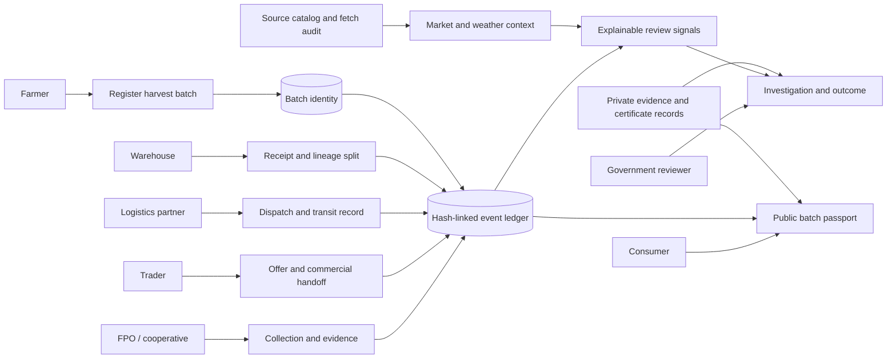

The product serves seven distinct roles without turning each role into a separate disconnected application. The common source of record is the batch, while organization membership and batch participation determine who can act, who can inspect, and who can only consume redacted information.

| Role | Core job | Primary product surface | Controlled outcome |
|---|---|---|---|
| Farmer | Register harvest and assess an offer in context. | Harvest registration, workspace, market intelligence. | Farm-owned batch with an attributable harvest event. |
| FPO / cooperative | Receive lots and coordinate a controlled handoff. | Event desk, operations desk, membership and handoff desks. | Collection evidence, custody participation, accountable imports. |
| Trader | Record commercial offer and permitted handoff steps. | Event desk and operations desk. | Attributed trader offer; no implied price-fairness result. |
| Logistics partner | Record transfer state, route context, and delay evidence. | Event desk and operations desk. | Authorized dispatch/receipt progression and exception context. |
| Warehouse | Confirm receipt and manage traceable splits. | Warehouse Receipt and Operations Desk. | Receipt tied to dispatched custody; linked child lot rather than hidden adjustment. |
| Government reviewer | Prioritize and resolve explainable cases. | Government Cases and Assurance Desk. | Bounded outcome, provenance context, certificate state, and audit trail. |
| Consumer | Verify journey and disclosures without private data. | `/verify/:batchCode` public passport. | Redacted trace record with evidence/certificate summary and ledger boundary. |

---

## 3. System architecture

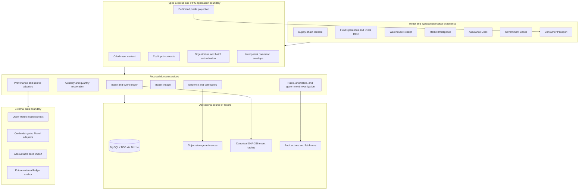

The implementation keeps a React, TypeScript, Express, tRPC, Drizzle, and MySQL foundation. This avoids unnecessary framework churn while keeping each product concern in a focused service boundary. tRPC procedures are the typed contract, domain services enforce business invariants, and the public consumer route does not reuse the private batch query.

### 3.1 Domain modules and invariants

| Domain module | Primary records | Invariant enforced by the application |
|---|---|---|
| Identity and organization | Organizations, memberships, participant assignments. | A user acts through an active organization role, never merely through a UI selection. |
| Batch registry | Batches, lifecycle state, parent/child links. | A batch has controlled ownership and an explicit lineage relationship. |
| Event ledger | Events, canonical payload hashes, verification state. | Critical history is append-oriented; a correction becomes a new event rather than a silent overwrite. |
| Custody | Transfers, status transitions, quantity reservation. | Proposed, accepted, and dispatched quantity cannot exceed available attributable quantity. |
| Evidence and assurance | Event evidence, certificates, review outcomes. | Private evidence stays private by default; consumer-safe summaries are deliberate. |
| Provenance | Sources, fetch runs, market/weather observations. | A value is presented as current context only after a timestamped source result is persisted. |
| Investigation | Anomalies, government queue, resolutions, audit actions. | A review outcome records context but does not rewrite the original ledger event. |
| Public passport | Redacted consumer record and QR route. | No private identity, evidence storage key, document hash, or case note crosses the boundary. |

---

## 4. Data model and integrity boundary

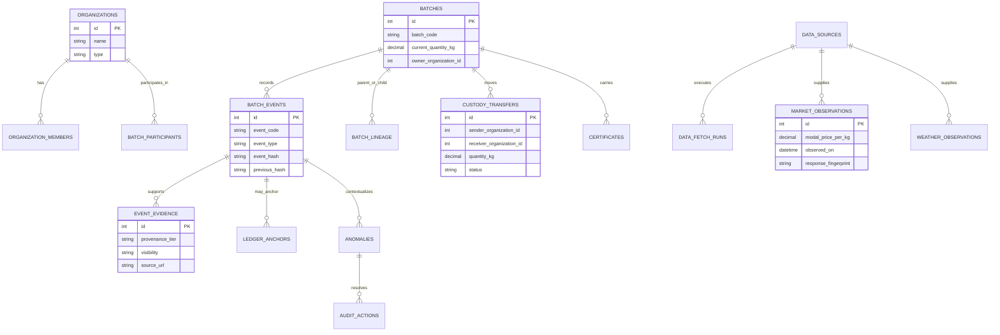

### 4.1 Tamper-evident ledger statement

Every critical batch event is normalized, canonically serialized, and SHA-256 hashed with the preceding event hash. The application can later verify whether a recorded event chain has been silently altered. This is an **application-level tamper-evident ledger**. It does not establish that every physical claim was true, and it does not become an external blockchain anchor unless an anchor adapter succeeds and persists an external reference.

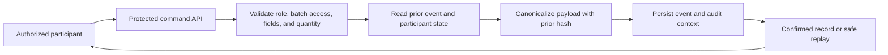

---

## 5. Role and access model

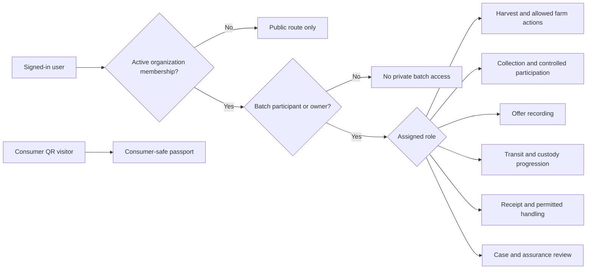

Authorization is evaluated server-side. User interface availability is not the authority: procedures validate the current user, organization role, batch participation, permitted event type, transfer state, and input constraints before a write is accepted.

| Access plane | Can see | Can change | Deliberately cannot see or change |
|---|---|---|---|
| Operational participant | Assigned batch detail, permitted evidence, transfers, and lineage. | Only actions allowed by its organization role and batch participation. | Private records for unrelated batches; another organization's role scope. |
| Government reviewer | Case queue, evidence tier, certificate status, cited context, and anchor state. | Bounded certificate review and case resolution outcome. | Silent ledger rewrites or public release of case notes. |
| Consumer visitor | Public status, selected events, consumer-safe evidence/certificate summary. | Nothing. | PII, contacts, ownership, evidence URLs, hashes, internal notes, financial/private attachments. |

---

## 6. Core operational workflows

### 6.1 Shippable batch journey

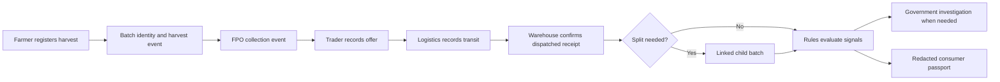

The workflow allows each actor to record the step it owns. The application does not infer a change of custody from an offer, receipt, or route description alone.

### 6.2 Custody state machine

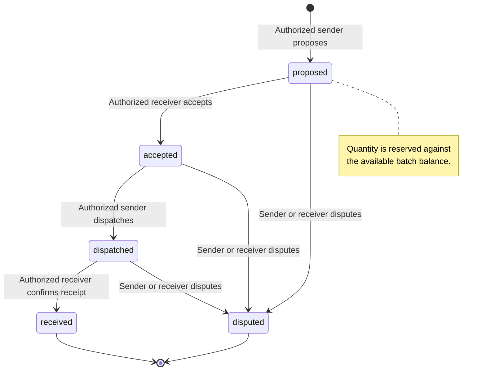

### 6.3 Retry-safe field command flow

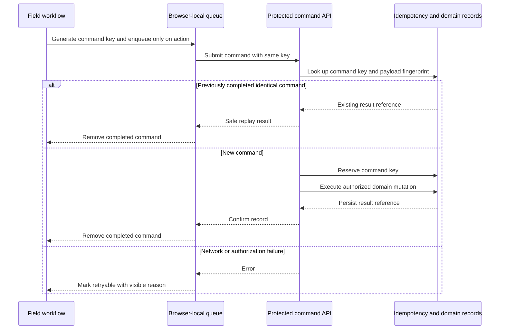

The queue is intentionally **manual**. A pending command is not proof of a completed handoff, receipt, inspection, or split. It becomes an operational record only after a server-confirmed response.

---

## 7. Provenance and external context

### 7.1 Provenance model

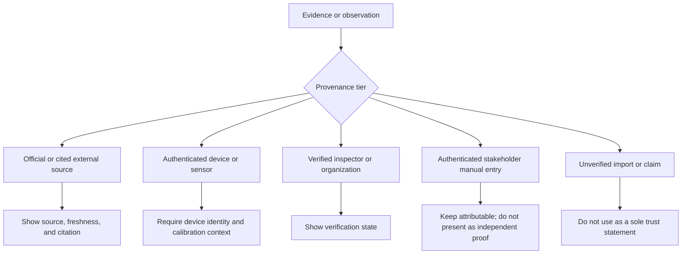

| Provider or record | Current posture | Product label |
|---|---|---|
| Open-Meteo | Live no-key weather-model context is available through a documented standard endpoint. [4] | **Weather-model context**, never cold-chain sensor proof. |
| CEDA Agmarknet API | Adapter exists; endpoint access requires a legitimate API key. [2] | **Official source unconfigured** until a successful timestamped fetch. |
| India Open Government Mandi | Adapter exists; official resource/API requires a generated key. [3] | **Official source unconfigured** until configured. |
| Agmarknet web reporting | Official reporting workflow is interactive and CAPTCHA-protected. [1] | Do not scrape; use an approved adapter or export. |
| Accountable manual import | Authorized FPO/government input with organization, citation, observation date, and audit metadata. | **Authenticated manual**; never mislabeled as live official feed. |

### 7.2 External-source decision flow

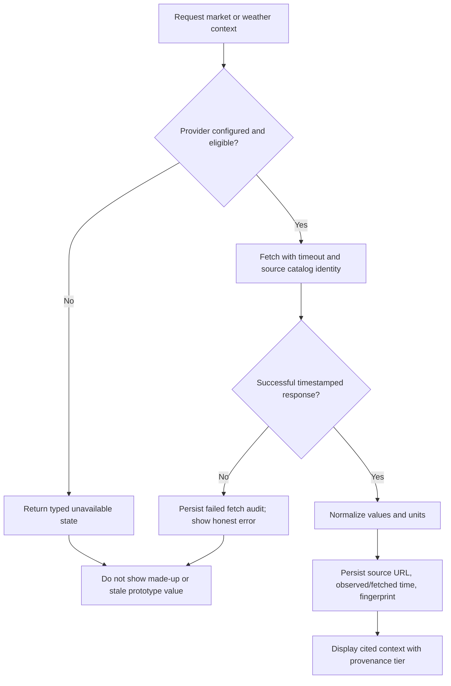

---

## 8. Investigation, assurance, and public transparency

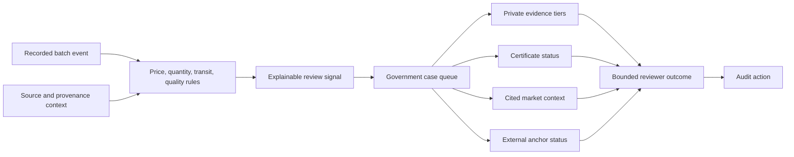

Government Cases is intentionally an investigation workspace rather than an accusation interface. The selected case shows the observed input, expected basis, explanation, evidence tier, certificate state, cited context, and anchor status. An outcome is attributable and auditable, while the original batch ledger remains unchanged.

The consumer passport is deliberately smaller than the private investigation record.

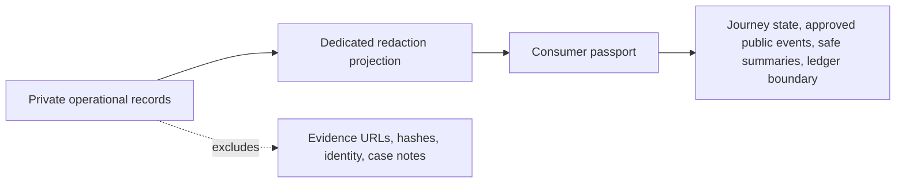

---

## 9. Product information architecture

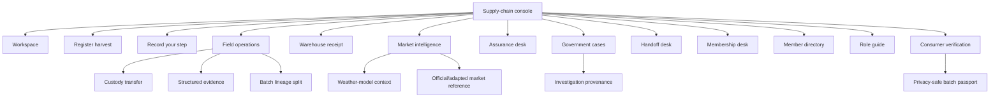

---

## 10. Production operating posture

### 10.1 Request and session boundaries

| Control | Implemented behavior | Purpose |
|---|---|---|
| OAuth context | Protected procedures derive the current actor from server context. | Prevents client-provided identity from authorizing a command. |
| Schema limits | Typed Zod contracts bound field lengths, numeric ranges, URLs, and IDs. | Reduces malformed or oversized business inputs. |
| Request-body limit | JSON and URL-encoded bodies are limited to 1 MB. | Evidence bytes stay in object storage rather than operational request bodies. |
| Security headers | Anti-sniffing, anti-framing, strict referrer, and restrictive device-permission headers are emitted. | Reduces common browser exposure. |
| API cache policy | tRPC responses use `Cache-Control: no-store`. | Reduces private workflow data persistence in shared caches. |
| Safe server failure | Oversized requests receive a bounded response; generic request failures are sanitized. | Avoids response-level internal error disclosure. |
| Health route | `GET /healthz` returns only service availability. | Supports a non-sensitive availability probe. |

### 10.2 Production readiness diagram

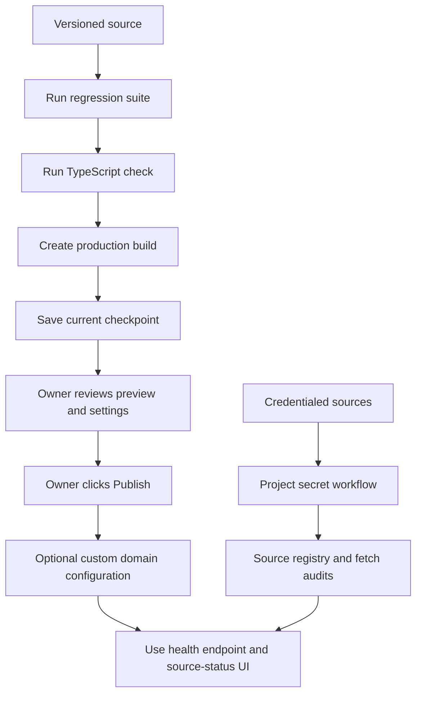

Publishing itself is an owner action through the project interface; this document does not claim that a deployment has already been published. Before publishing, official market data must remain unconfigured unless legitimate keys have been supplied through the secret workflow. External anchor wording must remain unavailable until an adapter persists a successful external reference.

---

## 11. Verification evidence

The production-oriented source was verified with the following internal quality gates:

| Quality gate | Result |
|---|---|
| Automated tests | **27 test files / 37 tests passed**. |
| TypeScript | `pnpm check` passed. |
| Production bundle | `pnpm build` passed. |
| Health probe | `GET /healthz` returned `200` with the intended safety headers. |
| Responsive review | Desktop and mobile preview checks covered core console, intelligence, operations, warehouse, assurance, government, and public-passport surfaces. |
| Rendered interactions | DOM tests exercised focus order and visible failed-action states across Operations, Warehouse Receipt, Assurance, Government Cases, Market Intelligence, and the shared FPO/trader/logistics Event Desk. |

Personal authenticated-browser validation was intentionally skipped at the owner’s direction. This is documented as a validation scope choice only; it does not reduce or bypass OAuth, organization, participant, custody, evidence, or public-redaction authorization rules.

---

## 12. Honest capability boundary

| Capability | Current statement |
|---|---|
| Hash-chain history | **Verified application-level tamper-evident event chain.** |
| External blockchain / ledger anchor | **Not configured.** |
| Government market feed | **Credential-gated and unconfigured until a successful source fetch exists.** |
| Open-Meteo data | **Live model context with provenance; not a calibrated on-batch sensor.** |
| Certificate verification | **Internal record and bounded reviewer outcome; not an issuer-registry integration.** |
| Fair-price conclusion | **Not provided.** A reference can contextualize an offer but does not prove fairness. |
| Regulatory endorsement | **Not claimed.** |
| Offline behavior | **Visible manual retry queue, not automatic background synchronization.** |

## 13. Immediate next production actions

1. **Publish the checkpoint** through the project interface only after the owner reviews the preview and applies the desired visibility/domain setting.
2. **Enable an official Mandi provider only with a legitimate key** supplied through the project secret workflow; retain the present unavailable state otherwise.
3. **Select an anchoring strategy only if it has a real adapter, authorization model, and external-reference verification path.** Until then, retain the tamper-evident application-ledger wording.
4. **Establish a backup routine** if the owner’s official account notice indicates the August 2026 service-change process applies. A Task Data export is a point-in-time snapshot, not a continuous data sync.[5] [6]

## References

[1]: https://agmarknet.gov.in/ "Agmarknet 2.0"
[2]: https://api.ceda.ashoka.edu.in/documentation/ "CEDA Agmarknet API Documentation"
[3]: https://data.gov.in/apis/9ef84268-d588-465a-a308-a864a43d0070 "India Open Government Mandi API Detail"
[4]: https://open-meteo.com/en/docs "Open-Meteo API Documentation"
[5]: https://help.manus.im/en/articles/16147892-service-change-overview-how-to-back-up-your-data "How to Back Up Your Data"
[6]: https://help.manus.im/en/articles/16147831-service-change-overview-what-s-happening-and-am-i-affected "What’s Happening and Am I Affected?"
